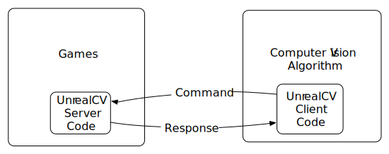

# UnrealCV
<!-- What is UnrealCV -->
UnrealCV is a project to use photo-realistic game for computer vision research. In this project, we extend games to provide annotation for the virtual scene. We also provide python/MATLAB code to interact with the virtual scene.

Unreal Engine is one of the best game engines, it provides excellent rendering power. Naive Physics. Unreal Engine is open source and creates enormous possibility. Games designed using Unreal Engine can be extended by UnrealCV. We will provide a few compiled examples and show how to extend a game yourself.

UnrealCV is a project to bridge game industry with computer vision research community. Games are designed for players. We compile UnrealCV server code inside a game to make it able to communicate with our clients.

- List of Compiled Games <!-- create a model zoo for it -->
- [UnrealCV Server](server.html)
- [UnrealCV Client](client.html)
- Command and Response format

<!---->

<!-- </img> -->
<!-- <object data="/images/pipeline.svg" type="image/svg+xml">
  Your browser does not support svg
</object>
<object width="100px" data="/images/pipeline.svg" type="image/svg+xml">
</object> -->
<!-- <embed type="image/svg+xml" src="/images/pipeline.svg"/> -->

We provide a few scenes modified from Unreal Engine demos or open source game. A more complete list can be found [here](games.html). The digital content belongs to the original author.

Here we will show how to use the binaries we provided. If you want to make our own scene interactable, please read about how to use the [plugin system](server.html).    

Here we will use RealisticRendering as an example. RealisticRendering is a demo created by Epic Games to showcase the rendering ability of UnrealEngine.

# Getting Started

First, download the binaries of this game. [Windows](), [Linux](). (Tested in Ubuntu 14.04)

Unzip it and Run `[Platform]NoEditor/RealisticRendering/Binaries/[Platform]/RealisticRendering`. If the program crash for any reason, you can reported [an issue]().

ADD A FIGURE TO ILLUSTRATE THE PIPELINE
# Interact with the program

## The command system
<!-- Better help system -->

The virtual scene can be controlled in a very simple way. The client can send a command to the game and game will return a response.

The scene is interactable with a predefined set of commands. Use **`** key to invoke the console built-in. Type it twice to get the command windows.

Try a simple command `vset /mode/depth` to show the depth of this scene and use `vset /mode/lit` to switch back to normal.

A complete list of available commands can be found in [command cheatsheet](commands.html). A more detailed explanation of the command system can be found [here](commands.html)

## Connect with the program  
We provide python/MATLAB wrapper to interact with the virtual scene. A more detailed description of the wrapper is documented in [here](client.html).

`python demo_client.py` to run a demo script. This demo will show message sent from the virtual scene and can also send commands. How to use python script to generate an image dataset, see [generate dataset](ipynb_generate_images.html) for a step-by-step instruction.

The python client is documented [here](client.html#python).

Understand the command system.

# Feature

Cross-platform, Easy to integrate with existing code, Extensible.

# Citation

If you found this project useful for your research. Please cite our paper <>.

If you have any suggestion or want to need help of using this in your project you can contact us in [Gitter]() or through email.
